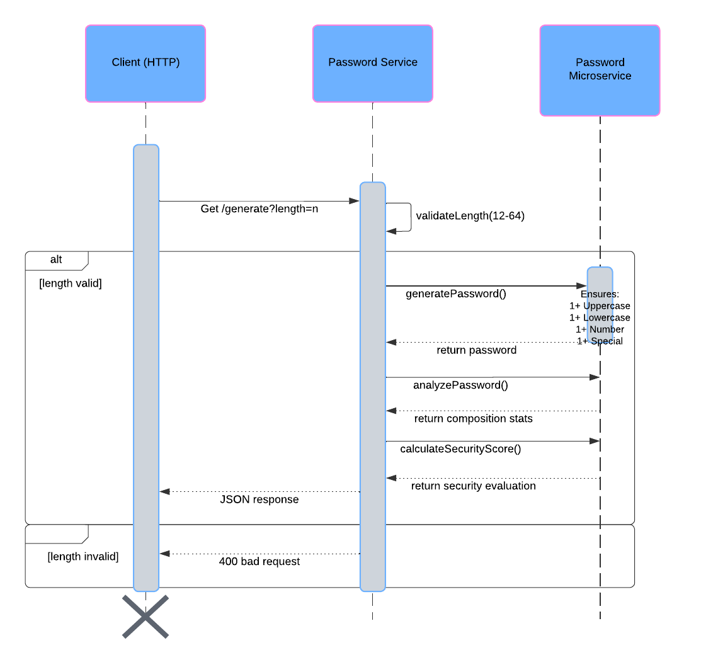

# Installation

1. Go to the project Releases page: https://github.com/nzwart/361-microservice-A/releases

### If on Windows:

2. Download `zwartn-microserviceA.exe`
3. Navigate to download folder and double-click `zwartn-microserviceA.exe`
4. If you see a security warning:
    - Click "More info"
    - Click "Run anyway"

### If on ARM macOS:

2. Download `zwartn-microserviceA-mac-arm64`
3. Open a terminal
4. Navigate to the download folder
5. Make the file executable: `chmod +x zwartn-microserviceA-mac-arm64`
6. Run it: `./zwartn-microserviceA-mac-arm64`

# Usage

Once the microservice is running, the user should open a terminal window (separate from the one used to run the microservice if on macOS) and enter this line:

`curl http://localhost:8080/generate`

If a password json like one below is recieved, the test request was successful.

```json
{
    "password": "x1q,%lT(wer7",
    "analysis": {
        "totalLength": 12,
        "uppercaseCount": 1,
        "lowercaseCount": 6,
        "numberCount": 2,
        "specialCharCount": 3
    },
    "security": { "scoreLevel": 4, "evaluation": "Very Strong" },
    "metadata": {
        "standard": "NIST SP 800-63B",
        "compliance": "Compliant",
        "version": "1.0.0"
    }
}
```

### Running the test client

As an alternative to manually entering a curl request to the running microservice, if the user has cloned this repo, then the user can run the test_client to automate the testing of the local microservice.

From the project dir run `go run cmd/test_client/main.go` and the user should see multiple JSONs returned and printed to the terminal.

## How to request data from the microservice

To request data from the microservice, send an HTTP GET request to:

-   Endpoint: http://localhost:8080/generate
-   Method: GET
-   Optional Query Parameters:
    -   length: Integer between 12 and 64 (e.g., http://localhost:8080/generate?length=16)

Example call in Python:

```py
import requests

# Make GET request to the microservice
response = requests.get("http://localhost:8080/generate")

# For custom length
response = requests.get("http://localhost:8080/generate?length=16")
```

## How to recieve data from the microservice

The microservice returns data in JSON format with the following structure:

```ts
interface PasswordPackage {
    password: string; // The generated password -- can ignore the rest of the JSON if this is the only data needed
    analysis: {
        totalLength: number;
        uppercaseCount: number;
        lowercaseCount: number;
        numberCount: number;
        specialCharCount: number;
    };
    security: {
        scoreLevel: number; // Security score (0-5)
        evaluation: string; // Evaluation text ("Weak", "Moderate", "Strong", or "Very Strong")
    };
    metadata: {
        standard: string;
        compliance: string;
        version: string;
    };
}
```

Processing example in Python:

```py
import requests

response = requests.get("http://localhost:8080/generate")
data = response.json()

# Access the generated password (may only need this!)
password = data['password']

# Access password analysis
length = data['analysis']['totalLength']
uppercase_count = data['analysis']['uppercaseCount']

# Check security evaluation
security_score = data['security']['scoreLevel']
security_eval = data['security']['evaluation']
```

# UML Sequence Diagram

How requesting and receiving data from the microservice works:



# Building the executables (if necessary)

Run from project dir:
`chmod +x build.sh`
`./build.sh`
